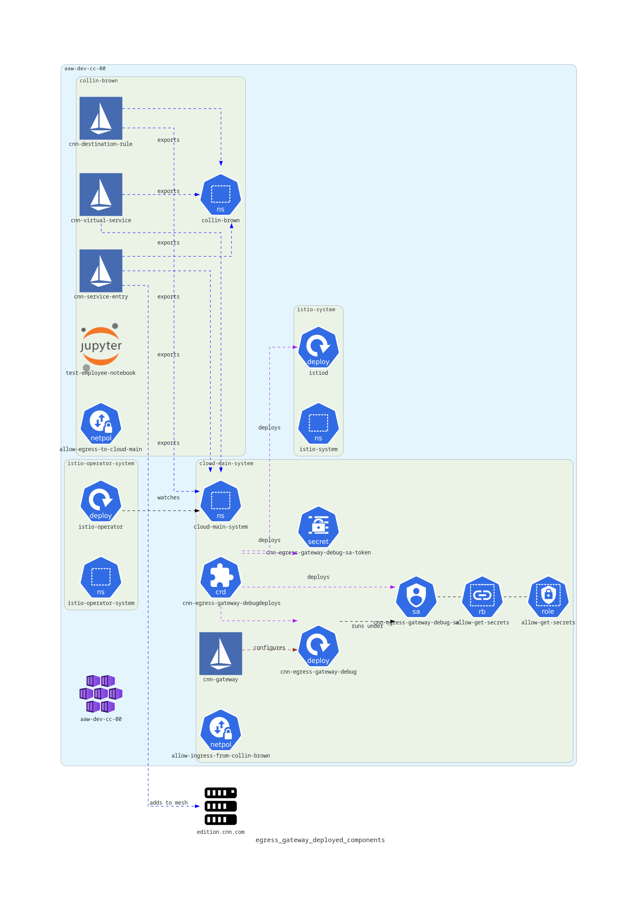
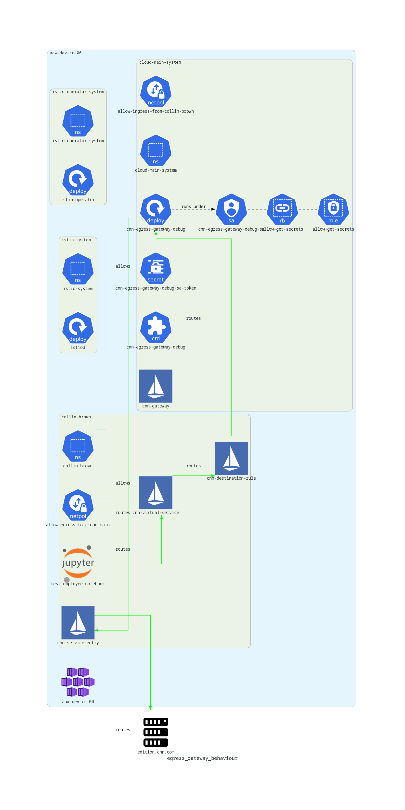

# Steps to Reproduce (`cloud-main-system` namespace in aaw-dev-cc-00)

Deploy notebook pod into different namespace (`collin-brown`), egress gateway into system namespace (`cloud-main-system`), and add network policies to allow communication between the two namespaces.

1. Deploy manifests folder `kubectl apply -f manifests-different-namespace/ --recursive`
2. Open a shell into the `test-employee-notebook` pod in namespace `collin-brown`
3. Run `curl -svL -o /dev/null -D - https://edition.cnn.com/politics`

Tear down example with `kubectl delete -f manifests-cloud-main/ --recursive`

# Documentation / Architecture Diagrams

The purpose of this section is to document the setup for this standalone example in a working state. A number of changes will be made, so the diagrams below will be updated accordingly (TODO: link issue with proposed changes).

Note that I split these diagrams into two parts to reduce clutter. The first diagram illustrates how the various components are deployed and configured, while the second diagram shows the routing that takes place with the Istio egress gateway and how the various istio components fit together.

## Egress Gateway Deployed Components

The diagram below outlines the various Kubernetes components that are involved with deploying the Egress gateway.

## Egress Gateway Behaviour

The diagram below shows the routing logic that takes place with the egress gateway.

# Notes

- [istio traffic management concepts](https://istio.io/latest/docs/concepts/traffic-management/#destination-rules) - explains destination rules and virtual services

**Attribution**[^1][^2]

[^1]: Istio icons provided by [Istio Media Resources](https://istio.io/latest/about/media-resources/)
[^2]: Jupyterlab icon from [wikimedia-commons](https://commons.wikimedia.org/wiki/File:Jupyter_logo.svg)